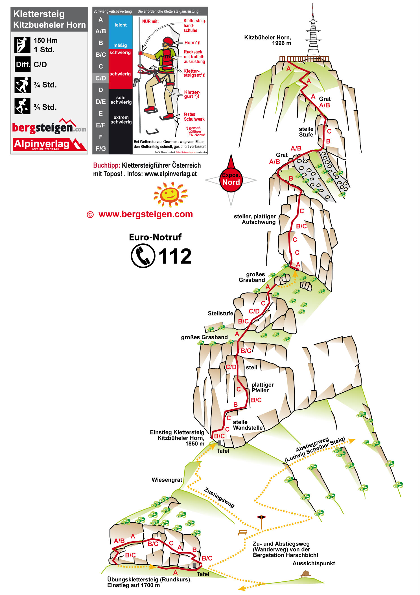

# Klettersteig Kitzbüheler Horn

## Eckdaten

🗓️ 01.08.2024 - Mittag  
⛰️ Klettersteig  
🔗 [bergsteigen.com](https://www.bergsteigen.com/touren/klettersteig/klettersteig-kitzbueheler-horn/)

## Erinnerungen

Erste Tour des Urlaubs am Anreisetag nach Check-In im Hotel. Zu Fuß vom Hotel zur nahegelegenen Seilbahn in St. Johann, die hoch zum Ausgangspunkt der Tour, also dem Zustiegsweg führte. Eine schöne Tour mit kleinem Mittagessen am Turm. Auf dem Rückweg gerade so bei gutem Wetter noch die Seilbahn ins Tal bekommen, anschließend dann Regen.

## Meine Fotos

## Topo

