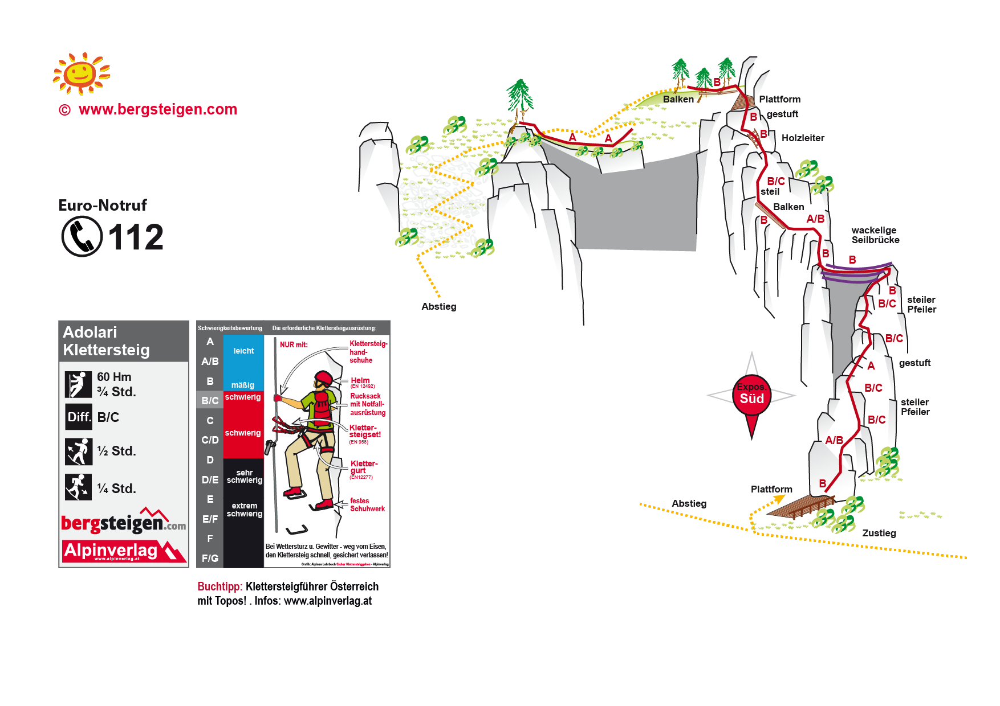

# Adolari Klettersteig

## Eckdaten

🗓️ 02.08.2024 - Nachmittag  
⛰️ Klettersteig  
🔗 [bergsteigen.com](https://www.bergsteigen.com/touren/klettersteig/adolari-klettersteig/)

## Erinnerungen

Nachdem wir wegen der Wetterverschlechterung die Klettertour am [Ellmauer Tor](2024-08-02_ellmauer_tor_tour.md) abbrechen mussten, haben wir uns auf den Adolari Klettersteig begeben. Es war sehr warm und durch einen Regenschauer nass.

## Meine Fotos

## Topo

