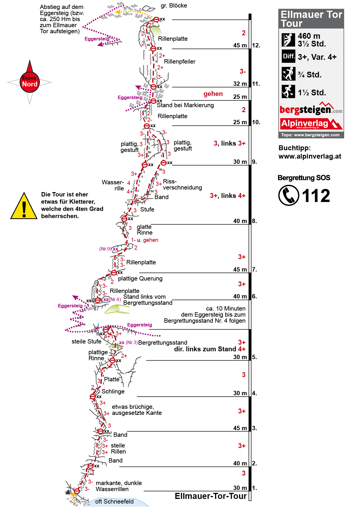

# Ellmauer Tor Tour

## Eckdaten

🗓️ 02.08.2024 - Vormittag  
⛰️ Klettern  
🔗 [bergsteigen.com](https://www.bergsteigen.com/touren/klettern/ellmauer-tor-tour/)

## Erinnerungen

Leider war das Wetter umgeschlagen. Über dem Ellmauer Tor zogen schwarze Wolken auf und es war Gewitter in der App angekündigt. Daher haben wir die Klettertour am kreuzenden Eggersteig nach 5 Seillängen verlassen. Weiter ging es am selben Tag auf dem [Adolari Klettersteig](2024-08-02_adolari_klettersteig.md).

## Meine Fotos

## Topo

