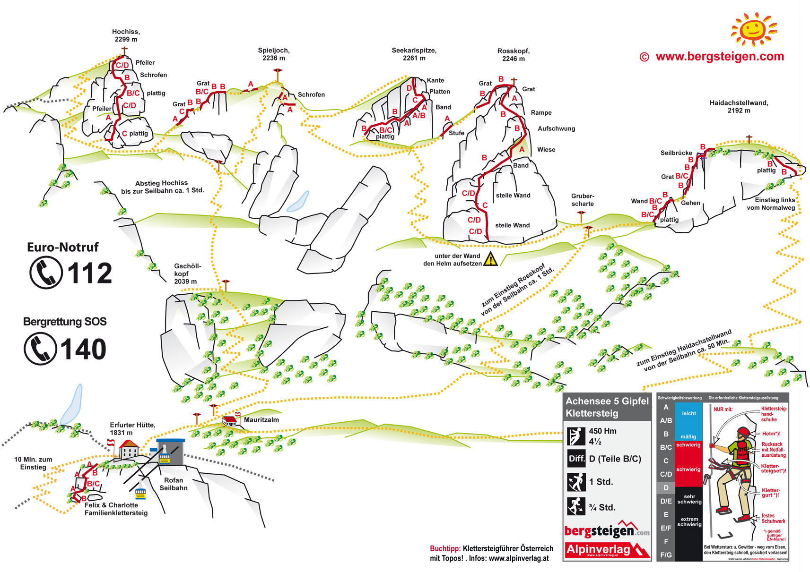

# Achensee 5 Gipfel Klettersteig

## Eckdaten

🗓️ 01.08.2024 - Vormittag  
⛰️ Klettersteig  
🔗 [bergsteigen.com](https://www.bergsteigen.com/touren/klettersteig/achensee-5-gipfel-klettersteig/)

## Erinnerungen

Aufgrund des schlechten Wetters kurzfristig nicht zum Ulrichshörndl zum Seilklettern. Daher als Ersatzstour zu den fünf Gipfeln am Achensee. Dort mit der Rofan Seilbahn zum Ausgangspunkt ab der Mauritzalm. Zuerst zur Haidachstellwand. Da es relativ stark geregnet hat, dann nur das erste Stück bis zum möglichen Ausstieg über den Klettersteig. Alles sehr glatt, also ab da Wandertour. Bis zur Kreuzung zwischen Seekarlspitze und Rosskopf. Dort wegen der Nässe und damit den rutschigen Steinen nicht hoch zum Rosskopf, sondern auf das Spieljoch. Dort waren die Wolken bis auf knapp 10m Sicht runter. Ab dort Abbruch und zurück zur Seilbahn. 

## Meine Fotos

## Topo

